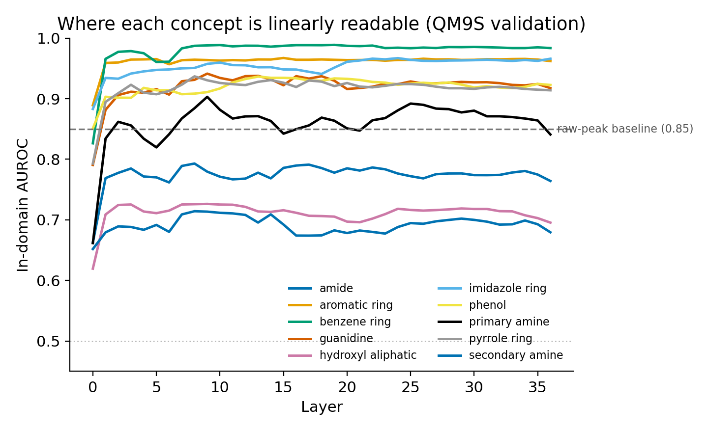
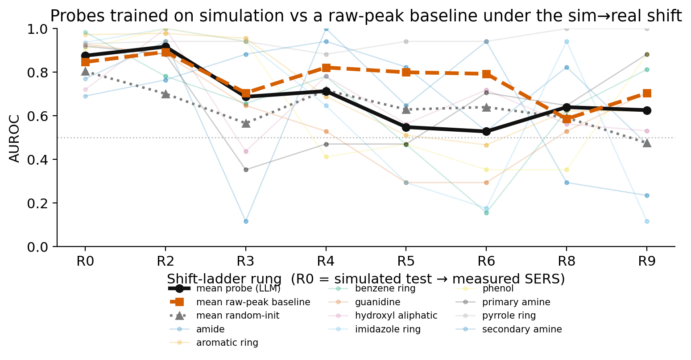
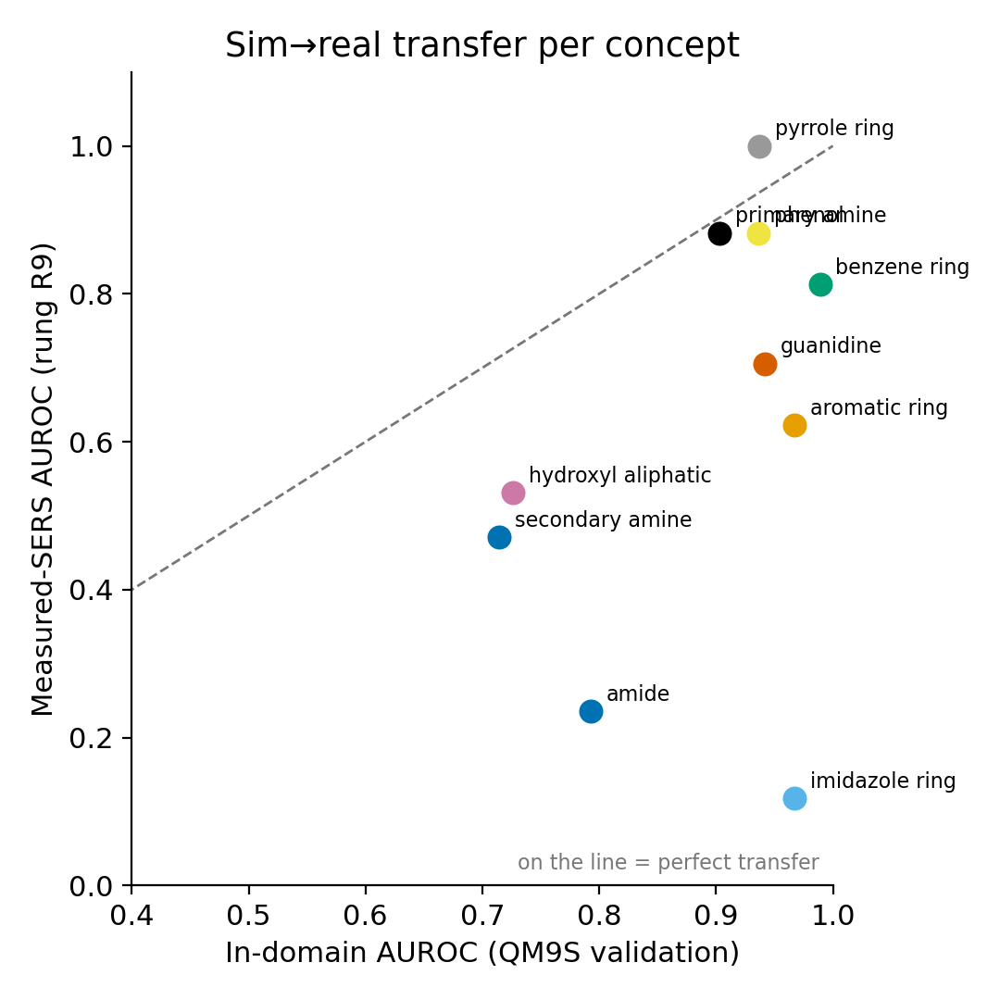

# Probes to Circuits With a Ground Truth for Spectroscopy 

**Investigating whether a linear probe on an LLM's activations stops working under distribution shift in the context of experimental vs synthetic (DFT) spectroscopy data, and whether looking inside the model can predict the failure before it happens**

Monitors like probes are usually trained on synthetic data and then used on real data, and how well they survive that change is an open problem in AI safety. This repository measures it where the ground truth is known: molecular spectra written as text, with probes trained on simulated (DFT) spectra and tested on experimental / measured (SERS) ones. Physics says exactly how the two distributions differ and which peaks a correct probe should rely on. This shift ladder is anchored in physics where we have a ground truth for what it should look like.

## Summary

- **Setup.** Qwen3-8B reads a spectrum written as a peak-list string. A linear probe is trained on its residual-stream activations to detect a chemical concept (for example "contains a primary amine"). Probes are trained on simulated spectra and tested along a **shift ladder** that adds one physical difference at a time until the input is a real SERS measurement.
- **Why it is a good testbed.** The simulated→real shift is decomposed into named, physical steps (frequency scaling, line broadening, protonation, surface selection rules, substrate peaks), and chemistry says which peaks carry the signal. So a failure can be traced to a specific cause, and "did the probe use the right feature?" has a checkable answer.
- **What it tests.** (1) whether the concept is linearly decodable and where in the model; (2) how far the probe degrades along the ladder and at which rung it breaks; (3) whether attribution to the probe's direction predicts those failures; and (4) whether the same picture holds for a safety concept (a harmful-request probe).
- **Relevance to safety.** Anthropic lists the robustness of activation monitors to distribution shift — especially the shift from synthetic to real data — as an open problem. This is a controlled measurement of exactly that, with a physical ground truth standing in for the usually-missing one.

| Spectroscopy testbed | Activation monitoring |
|---|---|
| DFT-simulated spectra | Synthetic / off-policy training data |
| Measured SERS spectra | Deployment data |
| Frequency scaling, broadening | Paraphrase, change of style |
| Surface selection rules, substrate peaks | Jailbreak wrappers, format shifts |
| Deuteration (label unchanged) | Translation (label unchanged) |
| Gene knockout (label flips, little else) | Minimal pairs |
| Known peak assignments | Ground truth for what a monitor should rely on |

## Results so far

**Key result.** A probe on the model's internals is no more robust to the sim→real shift than logistic regression on the raw peaks, and on the mid-ladder rungs it is worse.

**Status:** baselines and in-domain probes complete (through step 2c); shift-ladder degradation complete; attribution and the safety twin not yet run.

### 1. The concepts are linearly decodable, but the probe barely beats a classifier on the raw peaks



*Figure 1. Probe AUROC at each layer of Qwen3-8B on QM9S validation spectra (train and test both simulated), one line per concept. The dashed line is the raw-peak baseline.*

AUROC on the simulated test set (R0, n = 2,774), with each probe at its selected layer:

| Concept | Layer | Probe (Qwen3-8B) | Raw-peak baseline | Random-init model |
|---|---|---|---|---|
| primary amine | 9 | 0.919 | 0.662 | 0.742 |
| secondary amine | 8 | 0.691 | 0.714 | 0.650 |
| amide | 8 | 0.770 | 0.725 | 0.699 |
| guanidine | 9 | 0.928 | 0.946 | 0.896 |
| hydroxyl (aliphatic) | 9 | 0.720 | 0.686 | 0.672 |
| phenol | 13 | 0.907 | 0.905 | 0.835 |
| aromatic ring | 15 | 0.972 | 0.968 | 0.930 |
| benzene ring | 19 | 0.984 | 0.982 | 0.867 |
| pyrrole ring | 8 | 0.931 | 0.946 | 0.845 |
| imidazole ring | 24 | 0.937 | 0.934 | 0.900 |
| **Mean of 10** | | **0.876** | **0.847** | **0.804** |

Raw-peak baseline: logistic regression on the peak list, with no language model. Random-init: the same probe on an untrained Qwen3-8B.

**Summary.** In simulation the probe reads all ten functional groups (mean AUROC 0.88), but it is only 0.03 above logistic regression on the raw peaks and 0.07 above an untrained network. It is ahead by more than 0.05 only for primary amine; for seven of the ten groups the raw-peak baseline is within 0.005 of the probe or higher. A probe trained on shuffled labels scores 0.48, so the probe is reading the concept and not memorising the set.

### 2. Probes trained on simulation degrade along the shift ladder, and no less than the raw-peak baseline



*Figure 2. AUROC at each rung, from the simulated test set (R0) towards measured SERS (R9). Bold lines are means over the ten concepts: probe (black), raw-peak baseline (orange, dashed) and random-init model (grey, dotted). Faint lines are the individual concepts.*

Probe AUROC by rung. **Bold** cells are below chance (0.5).

| Concept | R0 | R2 | R3 | R4 | R5 | R6 | R8 | R9 |
|---|---|---|---|---|---|---|---|---|
| primary amine | 0.92 | 0.88 | **0.35** | **0.47** | **0.47** | 0.71 | 0.65 | 0.88 |
| secondary amine | 0.69 | 0.76 | 0.88 | 0.94 | 0.82 | 0.53 | 0.82 | **0.47** |
| amide | 0.77 | 0.94 | **0.12** | 1.00 | 0.65 | 0.94 | **0.29** | **0.24** |
| guanidine | 0.93 | 0.88 | 0.65 | 0.53 | **0.29** | **0.29** | 0.53 | 0.71 |
| hydroxyl (aliphatic) | 0.72 | 1.00 | **0.44** | 0.78 | 0.56 | 0.72 | 0.56 | 0.53 |
| phenol | 0.91 | 1.00 | 0.94 | **0.41** | **0.47** | **0.35** | **0.35** | 0.88 |
| aromatic ring | 0.97 | 0.98 | 0.96 | 0.69 | 0.51 | **0.47** | 0.62 | 0.62 |
| benzene ring | 0.98 | 0.78 | 0.66 | 0.78 | **0.47** | **0.16** | 0.62 | 0.81 |
| pyrrole ring | 0.93 | 0.94 | 0.94 | 0.88 | 0.94 | 0.94 | 1.00 | 1.00 |
| imidazole ring | 0.94 | 1.00 | 0.94 | 0.65 | **0.29** | **0.18** | 0.94 | **0.12** |
| **Mean probe** | 0.88 | 0.92 | 0.69 | 0.71 | 0.55 | 0.53 | 0.64 | 0.63 |
| **Mean raw-peak baseline** | 0.85 | 0.89 | 0.71 | 0.82 | 0.80 | 0.79 | 0.59 | 0.70 |
| **Mean random-init** | 0.80 | 0.70 | 0.57 | 0.72 | 0.63 | 0.64 | 0.59 | 0.48 |

**Summary.** The mean probe AUROC falls from 0.88 on simulated spectra to 0.53–0.71 on rungs R3–R9, and at R5 and R6 half of the ten concepts are below chance. On R4–R6 the raw-peak baseline holds up better than the probe (0.82, 0.80, 0.79 against 0.71, 0.55, 0.53), so the model's internal representation gives no extra robustness to this shift.

**How far to trust this.** R0 has 2,774 molecules. Rungs R2–R9 have 18 (the paired amino acids), and most concepts have only one to three positives or negatives among them, so single cells in the table are noisy. The comparison between the mean curves is the result; individual cells are not.

> **TODO (Mo):** say what each rung R2–R9 changes physically.

### 3. How well each concept transfers, at a glance



*Figure 3. Each point is a concept at its selected layer: in-domain AUROC on QM9S validation (x) against AUROC at the most-shifted rung, R9 (y). The diagonal is perfect transfer; distance below it is the sim→real gap.*

- Closest to the line: pyrrole ring (0.94 → 1.00), primary amine (0.90 → 0.88), phenol (0.94 → 0.88).
- Furthest below: imidazole ring (0.97 → 0.12), amide (0.79 → 0.24).
- Each point at R9 rests on 18 molecules, so read the overall pattern, not the position of one concept.

## Setup

- **Model.** Qwen3-8B (36 layers, 4,096-dim residual stream), with public transcoders from [circuit-tracer](https://github.com/decoderesearch/circuit-tracer) for the attribution stage.
- **Source domain.** QM9S: DFT Raman spectra for ~130,000 small molecules. Labels are ten functional groups computed from SMILES via RDKit.
- **Target domain.** Measured SERS spectra. The results above use the `matched` set: 18 amino acids with both a measured and a simulated spectrum.
- **Input.** Every spectrum, simulated or measured, goes through the same peak picker and string template; fields that leak the answer or the domain are stripped.
- **Probes.** L2 logistic regression and difference-of-means, per layer.
- **Baselines.** Majority class; logistic regression on raw peak vectors; the same probe on a randomly-initialised model; control tasks with shuffled labels.
- **Metrics.** AUROC (primary), TPR at 1% FPR, calibration error, and the in-domain→shifted drop. Intervals by bootstrap over molecules.

> **TODO (Mo):** correct anything above that differs from what you ran, and name the primary metric used in the figures.

## Still to come

- Attribution from the probe score to transcoder features, with ablations, to explain *why* a probe uses the peaks it does.
- Failure predictions written before testing, then checked on edited spectra, against input-gradient saliency and nearest-neighbour baselines.
- The safety twin: a harmful-request probe under paraphrase, translation and jailbreak wrappers.

## Reproduce

```bash
conda env create -f environment.yml && conda activate linear-probes-to-circuit-for-spectroscopy
python extract/run.py --model Qwen/Qwen3-8B --layers all
python probes/train.py --concept carboxylic_acid --train sim --test ladder
python plot_summary.py          # writes the three figures into assets/
```

## References

- Anthropic, [Recommendations for technical AI safety research directions](https://alignment.anthropic.com/2025/recommended-directions/)
- Anthropic, [Simple probes can catch sleeper agents](https://www.anthropic.com/research/probes-catch-sleeper-agents)
- Anthropic, [Fine-tuned lie detectors failed to generalize](https://alignment.anthropic.com/2026/lie-detectors/)
- Ameisen et al., [Circuit tracing](https://transformer-circuits.pub/2025/attribution-graphs/methods.html)
- Marks & Tegmark, [The geometry of truth](https://arxiv.org/abs/2310.06824)
- Hewitt & Liang, [Designing and interpreting probes with control tasks](https://arxiv.org/abs/1909.03368)
- Zou et al., [QM9S](https://www.nature.com/articles/s43588-023-00550-y)

## Licence

MIT. See `LICENSE`.
